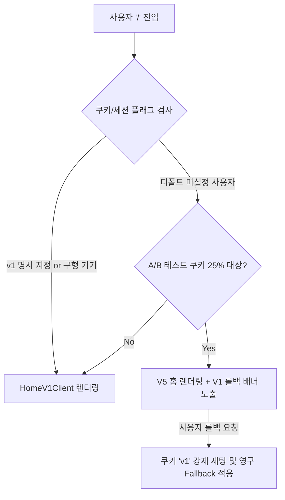

# v5 Connection-UX 디폴트 승격 롤아웃 검토 및 UX/안전성 비평

> **문서 상태**: 비평 단계 (Divergent Review)  
> **대상 범위**: `HomeV5Client` 승격에 따른 UX 충격 및 렌더 안정성 검증  
> **검토 목적**: "Ship It" 편향을 방지하고, 보수적 관점에서 디폴트 승격을 차단(BLOCK)해야 할 리스크 및 요건 정의  

---

## 1. Top 3 핵심 리스크 및 우선순위 (Risk Ranking)

기본 홈 화면을 V1에서 V5로 침묵 스왑(Silent Swap)할 때 발생하는 부작용을 리스크 크기순으로 정리합니다.

```
[High Risk] 1. 30초 콕핏 가독성 저하 (Cockpit Latency)
    └── V1 요약 뷰 대비 V5 스택의 높은 정보 복잡도가 신속한 상황 판단을 저해
[Medium Risk] 2. TickerChip 과밀로 인한 모바일 렌더 오버헤드 & 오클릭
    └── 모바일 기기에서의 스크롤 버벅임 및 터치 영역 간격 협소로 인한 사용성 훼손
[Low Risk] 3. 드로어 상태(Drawer State) 휘발 및 탐색 데드엔드
    └── 연결 콘솔 내 로컬 상태로 작동하는 Peek Drawer와 트레일이 브라우저 뒤로가기 시 초기화
```

### [P0] 리스크 1: 30초 콕핏 가독성 저하 및 인지 부하 (Cockpit Latency)
- **현상**: V1은 단일 Bento Grid(`HomeBentoGrid`) 레이아웃으로 공포탐욕 지수, 섹터 확산도, 마켓 스트레스를 한 화면에서 30초 이내에 직관적으로 파악할 수 있도록 튜닝되어 있습니다. 반면 V5는 `V5MarketNow` 횡스크롤 철도, `V5ReadingHero` 게이지, `V5MarketPulse` 타일, `LeadStoryCard` 외 6개 이상의 대형 카드가 단일 페이지에 수직 적재(`v5-stack`)되어 있습니다.
- **영향**: 기존 사용자가 첫 화면에서 핵심 매크로 신호와 지수를 즉각 훑어보는 "30초 브리프 머슬 메모리"가 완전히 파괴되며, 전체 대시보드를 파악하기 위해 다회 스크롤해야 하는 피로감이 가중됩니다.

### [P1] 리스크 2: TickerChip 과밀화 및 모바일 렌더링 성능 (Webkit Render Overhead)
- **현상**: V5 대시보드는 `TickerChip-everywhere` 패턴을 사용하여 거의 모든 종목 및 지수를 터치 가능한 칩으로 렌더링합니다. 또한 `pulseTint` 기능은 인라인 스타일에서 `color-mix` CSS 연산을 런타임에 다량 수행합니다.
- **영향**: 사양이 낮은 모바일 기기나 모바일 폴드(Fold) 환경에서 스크롤 성능이 크게 하락할 수 있으며, 좁은 밀도의 터치 요소들이 밀집되어 있어 스크롤 도중 의도하지 않은 종목 상세 페이지로 진입하는 오클릭(Misclick) 피로를 유발합니다.

### [P2] 리스크 3: 연결 콘솔 내 로컬 Drawer 및 트레일의 브라우저 비호환 (Drawer Dead-Ends)
- **현상**: `V5ConnectionConsole`은 `useTraversalTrail`을 통해 종목 및 13F 보유자 탐색 흔적(Trail)을 로컬 React State로 저장하고, `activeTileId`에 기반하여 Peek Drawer를 동적으로 렌더링합니다.
- **영향**: 모바일 사용자는 일반적으로 이전 화면으로 돌아가기 위해 브라우저 뒤로가기 제스처를 사용합니다. 그러나 연결 콘솔의 트레일이나 드로어 상태는 URL 히스토리와 연동되지 않으므로, 뒤로가기를 실행하면 연결 콘솔 내 이전 단계로 돌아가는 대신 홈 화면 자체를 이탈하거나 전체 탐색 맥락이 날아가 버리는 탐색 데드엔드 현상이 발생합니다.

---

## 2. default 승격을 차단(BLOCK)해야 할 v5 준비도 갭 (Readiness Gaps)

기본 홈으로 강제 적용하기 전에 반드시 해결되어야 할 미결 과제들입니다.

| 식별 ID | 차단 요인 (Blocker) | 비평 및 상세 내용 |
| :--- | :--- | :--- |
| **B-1** | **비동기 데이터 종속성 렌더 딜레이** | `loadStockConnectionIndex` 및 `loadStockServicesIndex`가 클라이언트 사이드 `useEffect`에서 비동기로 호출되어, 최초 진입 시 연결 콘솔 영역이 "확인 중" 상태로 껌벅거리며 렌더링 지연이 발생함. SSR 시점에 데이터를 주입하거나 스켈레톤 최적화가 선행되지 않으면 미완성 UX로 인지됨. |
| **B-2** | **모바일 터치 타깃 오클릭 방지 규격 미달** | `V5MarketPulse`의 촘촘한 타일 그리드 및 `V5MarketNow` 레일 내부 터치 타깃의 최소 높이/너비가 모바일 친화적인 기준(최소 44px * 44px)을 충족하지 못해 스크롤 시 터치 미스가 잦음. |
| **B-3** | **두홉(Two-Hop) 데이터 누락 및 껌벅임** | 스마트머니 두홉(`V5SmartMoneyTwoHop`) 진입 시 `loadByTickerHolders`가 250ms 디바운스 뒤에 호출됨. 이 짧은 딜레이로 인해 Drawer 전환 시 로딩 메시지가 강제 노출되고 화면이 껌벅거려 부드러운 전환을 방해함. |

---

## 3. 마이그레이션 전략 (Migration Governance)

일방적인 하드 컷오버 대신 사용자 충격을 분산하기 위한 단계적 전환 거버넌스를 제안합니다.



1. **점진적 노출 (Gradual Rollout)**: 
   - 초기에는 전체 트래픽의 25%를 무작위 할당하여 V5로 자동 전환하되, 2주 단위로 유저 메트릭 및 이탈률을 모니터링하여 50% -> 100%로 점차 확장합니다.
2. **상단 안내 배너 및 옵트아웃 제공**:
   - V5 첫 렌더링 시 상단에 "새로운 연결 대시보드가 적용되었습니다. [이전 V1 홈으로 돌아가기]" 배너를 팝업하여 사용자에게 즉각적인 선택권을 제공합니다.
3. **영구 Fallback 링크 제공**:
   - 사용자가 롤백을 누르면 `fenok_design_version=v1` 쿠키를 만료일 30일로 설정하여 브라우저 재진입 시에도 계속 V1 홈이 노출되도록 보장합니다.

---

## 4. 하드 제약 조건: V1의 영구 도달 가능성 및 바이트 무손상 유지 방안

- **바이트 단위 무손상(Byte-Intact) 원칙**: `HomeV1Client.tsx` 소스 코드는 단 1바이트도 수정하거나 건드리지 않고 그대로 보존합니다.
- **라우팅 구현**: 
  - `page.tsx` 내부 라우팅을 리팩토링할 때, 쿼리 파라미터 `?v1=1`이 명시되거나, 쿠키 값이 `"v1"`로 지정되어 있는 경우 `version.ts`에서 최우선으로 `v1`을 리턴하도록 강제합니다.
  - 이렇게 함으로써 v5가 기본값이 되더라도 사용자는 언제든지 `/?v1=1`을 북마크하여 이전 홈 화면에 안정적으로 접근할 수 있습니다.

---

## 5. 레거시 코드 (v2/v3/v4) 처리 방안

현재 `page.tsx`에 분기 처리되어 남아있는 `HomeV2Client`, `HomeV3Client`, `HomeV4Client`는 다음과 같이 처리할 것을 권장합니다.

- **V2 / V3 / V4 코드 Deprecate 권장**:
  - v5가 정식으로 기본 홈 승격 검토 단계에 진입했으므로 중간 과도기 버전이었던 V2, V3, V4는 사실상 더 이상 유지보수할 가치가 없습니다.
  - 이들을 방치하면 런타임 번들 크기 증가 및 Next.js 라우터 오버헤드 등 코드 부채만 유발합니다.
  - 단, 이번 v5 승격 작업과 **동시에** 삭제하면 롤백 시 사이드 이펙트 분석이 어려워지므로, **v5의 100% 롤아웃이 완료되어 안정화가 입증되는 즉시 `page.tsx` 및 관련 파일들을 완전히 제거(Clean-up)하는 2단계 마이그레이션 일정**을 수립해야 합니다.

---

## 6. 최종 롤아웃 게이트 (Rollout Gate Requirements)

V5를 default 홈으로 승격하기 전에 만족해야 하는 정량적/정성적 체크리스트입니다.

- [ ] **성능 벤치마크 통과**: 모바일 크롬/웹킷 디바이스 상에서 최초 로드 완료 시점(LCP)이 1.8초 이하를 유지할 것.
- [ ] **접근성(A11y) 검증**: V5 홈 화면 전체에 대해 Lighthouse 접근성 스코어 90점 이상 달성할 것.
- [ ] **오클릭 방지 가드레일**: 모바일 터치 요소 간 간격이 8px 이상 확보되고, `TickerChip`의 클릭 방지 영역(padding)이 명확히 확보될 것.
- [ ] **Drawer URL 연동**: 드로어 오픈 및 Traversal Trail의 각 단계가 브라우저 히스토리 스택(`window.history`)과 동기화되어 뒤로가기가 정상적으로 부분 상태 롤백을 수행할 것.
- [ ] **Fallback 라우트 확정**: `/?v1=1` 진입 시 V1 Bento 대시보드가 정상 렌더링되는 통합 테스트 통과.
