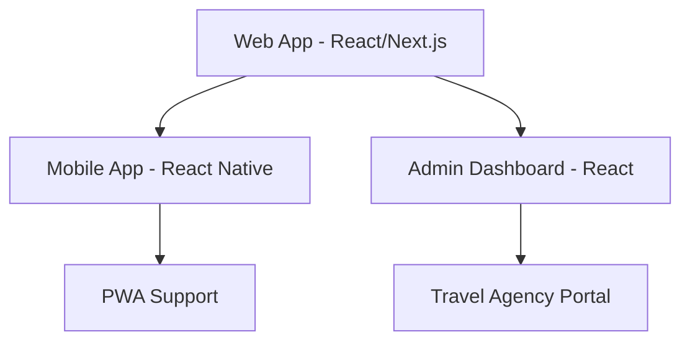
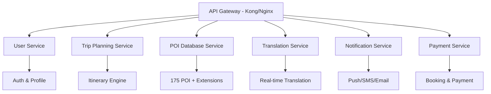
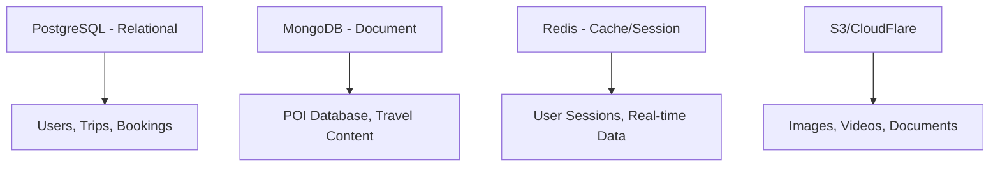
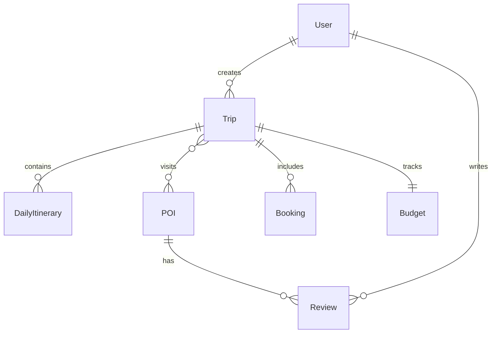
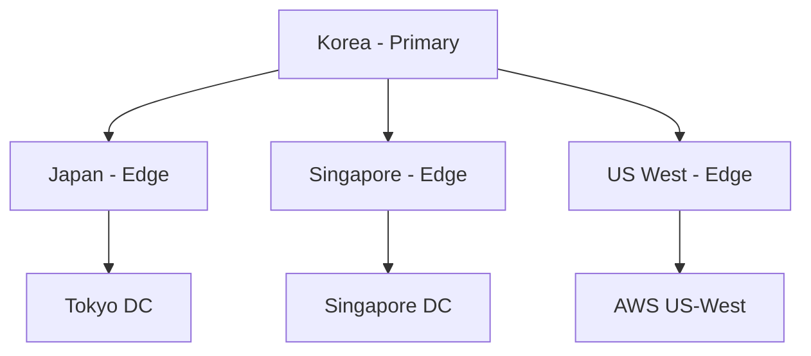

# 🏗️ 웹 플랫폼 확장 시스템 아키텍처 설계

## 📋 아키텍처 개요

### 설계 목표
- **ChatGPT Projects → 웹 플랫폼 확장**: 기존 시스템의 모든 기능을 웹에서 구현
- **확장성**: 미야코지마 → 일본 전역 → 글로벌 여행지 확장 가능
- **실시간성**: 실시간 통역, 개인화 가이드, 응급 대응
- **멀티 사용자**: 개인 여행자부터 여행사까지 다양한 사용자층 지원

### 핵심 원칙
- **마이크로서비스 아키텍처**: 독립적 배포와 확장 가능
- **API First Design**: 모든 기능을 API로 먼저 설계
- **데이터 중심 설계**: 175개 POI를 기반으로 한 구조적 데이터 활용
- **실시간 반응성**: WebSocket 기반 실시간 업데이트

## 🏛️ 시스템 아키텍처 (3-Tier + Microservices)

### 🎨 Frontend Layer


**기술 스택:**
- **Web App**: Next.js 14 + React 18 + TypeScript
- **Mobile App**: React Native + Expo
- **State Management**: Zustand + React Query
- **UI Framework**: Tailwind CSS + HeadlessUI
- **Real-time**: Socket.io Client

### ⚙️ Backend Layer (Microservices)


**기술 스택:**
- **API Gateway**: Kong + Docker
- **Backend Services**: Node.js + Express/Fastify
- **Database**: PostgreSQL (Core) + MongoDB (POI) + Redis (Cache)
- **Message Queue**: Redis + Bull
- **Real-time**: Socket.io + WebRTC

### 💾 Data Layer


## 🔗 데이터 모델 설계

### Core Entities
```typescript
// 사용자 프로필 (기존 traveler_profile.json 확장)
interface User {
  id: string
  email: string
  profile: {
    name: string
    preferences: TravelPreferences
    constraints: TravelConstraints
    language: string
  }
  travelHistory: Trip[]
  paymentMethods: PaymentMethod[]
}

// 여행 계획 (기존 itinerary_master.json 확장)
interface Trip {
  id: string
  userId: string
  destination: string
  dates: DateRange
  travelers: Traveler[]
  itinerary: DailyItinerary[]
  budget: BudgetTracker
  accommodations: Accommodation[]
  transportation: Transportation[]
  status: 'planning' | 'confirmed' | 'ongoing' | 'completed'
  realTimeData: {
    currentLocation?: Coordinates
    weatherConditions?: WeatherData
    emergencyContacts?: EmergencyContact[]
  }
}

// POI 데이터베이스 (기존 miyakojima_database.json 확장)
interface POI {
  id: string
  name: MultiLanguageString
  category: POICategory
  location: {
    coordinates: Coordinates
    address: MultiLanguageString
    accessInfo: AccessInfo
  }
  details: {
    description: MultiLanguageString
    hours: OperatingHours
    contact: ContactInfo
    pricing: PricingInfo
    features: string[]
    photos: Media[]
    reviews: Review[]
  }
  travelContext: {
    bestVisitTime: string[]
    visitDuration: number
    difficultyLevel: number
    weatherDependency: boolean
    coupledActivities: string[]
  }
  metadata: {
    confidence: number
    lastUpdated: Date
    source: string
    verification: VerificationStatus
  }
}
```

### Data Relationships


## 🛡️ 보안 아키텍처

### 인증/인가
```typescript
// JWT 기반 인증 + OAuth 2.0
interface AuthSystem {
  providers: ['email', 'google', 'kakao', 'line']
  tokenManagement: {
    accessToken: 15min
    refreshToken: 7days
    sessionStorage: 'redis'
  }
  permissions: {
    user: ['read:own', 'write:own']
    premium: ['read:own', 'write:own', 'access:premium-features']
    admin: ['read:all', 'write:all', 'manage:system']
  }
}
```

### 데이터 보호
- **개인정보 암호화**: AES-256 + Field-level encryption
- **API 보안**: Rate limiting + Request validation
- **GDPR 준수**: 데이터 삭제 권리 + 데이터 이동권
- **PCI DSS**: 결제 정보 보안 표준

## ⚡ 성능 최적화

### 캐싱 전략
```typescript
interface CacheStrategy {
  levels: {
    cdn: 'CloudFlare' // Static assets
    application: 'Redis' // API responses
    database: 'PostgreSQL query cache'
  }
  policies: {
    poi_data: '24h' // POI 정보는 24시간 캐시
    user_session: '15min' // 사용자 세션 15분
    search_results: '1h' // 검색 결과 1시간
  }
}
```

### Database Optimization
- **Read Replicas**: 읽기 전용 복제본으로 부하 분산
- **Indexing**: POI 검색 최적화를 위한 지리적 인덱스
- **Sharding**: 사용자별 데이터 샤딩
- **Connection Pooling**: 효율적 DB 연결 관리

## 📡 실시간 기능 설계

### WebSocket Architecture
```typescript
interface RealtimeFeatures {
  services: {
    translation: 'Real-time voice/text translation'
    locationTracking: 'GPS 기반 위치 추적'
    weatherUpdates: 'Weather API 통합'
    emergencyAlerts: 'Emergency notification system'
    groupChat: 'Multi-user travel chat'
  }
  infrastructure: {
    websocket: 'Socket.io with Redis adapter'
    scaling: 'Horizontal scaling with sticky sessions'
    failover: 'Automatic connection recovery'
  }
}
```

## 🌍 확장성 설계

### Horizontal Scaling
```yaml
# Kubernetes 기반 자동 확장
scaling:
  frontend:
    min_replicas: 2
    max_replicas: 10
    cpu_threshold: 70%
  
  backend:
    api_gateway:
      replicas: 3
    user_service:
      min_replicas: 2
      max_replicas: 8
    poi_service:
      min_replicas: 3
      max_replicas: 12
  
  database:
    read_replicas: 3
    write_master: 1
```

### Geographic Distribution


## 🔌 API 설계 (RESTful + GraphQL)

### REST API Endpoints
```typescript
// Core Travel APIs
interface TravelAPIs {
  authentication: {
    'POST /api/auth/login': LoginRequest
    'POST /api/auth/refresh': RefreshRequest
    'DELETE /api/auth/logout': LogoutRequest
  }
  
  trip_planning: {
    'GET /api/trips': GetTripsRequest
    'POST /api/trips': CreateTripRequest  
    'PUT /api/trips/:id': UpdateTripRequest
    'GET /api/trips/:id/itinerary': GetItineraryRequest
    'POST /api/trips/:id/optimize': OptimizeItineraryRequest
  }
  
  poi_discovery: {
    'GET /api/poi/search': SearchPOIRequest
    'GET /api/poi/:id': GetPOIRequest
    'GET /api/poi/nearby': GetNearbyPOIRequest
    'POST /api/poi/:id/reviews': CreateReviewRequest
  }
  
  realtime: {
    'WebSocket /ws/translation': TranslationSocket
    'WebSocket /ws/location': LocationSocket
    'WebSocket /ws/notifications': NotificationSocket
  }
}
```

### GraphQL Schema
```graphql
type Query {
  # 기존 데이터 조회 최적화
  trip(id: ID!): Trip
  poi(id: ID!): POI
  searchPOI(filters: POIFilters!): [POI]
  nearbyPOI(location: Coordinates!, radius: Float!): [POI]
  
  # 개인화 추천
  recommendedItinerary(tripId: ID!): ItineraryRecommendation
  personalizedPOI(userId: ID!, preferences: UserPreferences!): [POI]
}

type Mutation {
  createTrip(input: CreateTripInput!): Trip
  updateItinerary(tripId: ID!, itinerary: ItineraryInput!): Trip
  bookAccommodation(tripId: ID!, accommodationId: ID!): Booking
  submitReview(poiId: ID!, review: ReviewInput!): Review
}

type Subscription {
  # 실시간 업데이트
  tripUpdates(tripId: ID!): TripUpdate
  weatherAlerts(location: Coordinates!): WeatherAlert
  emergencyNotifications(userId: ID!): EmergencyNotification
}
```

## 🤖 AI/ML Integration

### 개인화 추천 엔진
```typescript
interface PersonalizationEngine {
  algorithms: {
    collaborative_filtering: 'Similar users preferences'
    content_based: 'POI features matching'
    hybrid_approach: 'Combined recommendation'
  }
  
  features: {
    trip_optimization: 'Route & budget optimization'
    dynamic_scheduling: 'Weather-based schedule adjustment'
    preference_learning: 'User behavior learning'
    context_awareness: 'Time, location, group context'
  }
  
  implementation: {
    ml_platform: 'TensorFlow Serving'
    feature_store: 'Feast'
    model_training: 'Kubeflow Pipelines'
    real_time_inference: 'Redis ML'
  }
}
```

### Translation & Language Support
```typescript
interface TranslationSystem {
  engines: {
    primary: 'OpenAI GPT-4 Turbo'
    fallback: 'Google Translate API'
    specialized: 'Travel domain fine-tuned models'
  }
  
  features: {
    voice_translation: 'Speech-to-speech translation'
    image_translation: 'OCR + translation for signs/menus'
    context_aware: 'Travel context understanding'
    cultural_adaptation: 'Cultural nuance handling'
  }
  
  supported_languages: ['ko', 'ja', 'en', 'zh', 'th', 'vi']
  real_time: 'WebSocket + WebRTC integration'
}
```

## 📱 Progressive Web App (PWA) 설계

### Offline Capability
```typescript
interface OfflineFeatures {
  cached_data: {
    essential_poi: 'Core POI data for offline access'
    offline_maps: 'Downloaded map tiles'
    translation_cache: 'Cached translations'
    emergency_contacts: 'Emergency information'
  }
  
  sync_strategy: {
    background_sync: 'Data sync when online'
    conflict_resolution: 'Automatic conflict handling'
    selective_sync: 'User-controlled sync preferences'
  }
  
  storage: {
    indexeddb: 'Large data storage'
    localstorage: 'User preferences'
    cache_api: 'Network request caching'
  }
}
```

### Native App Features
```typescript
interface NativeFeatures {
  device_integration: {
    gps: 'Precise location tracking'
    camera: 'Photo/QR code scanning'
    microphone: 'Voice translation'
    notifications: 'Push notifications'
    calendar: 'Calendar integration'
  }
  
  performance: {
    lazy_loading: 'Component-based lazy loading'
    code_splitting: 'Route-based code splitting'
    service_worker: 'Background processing'
    app_shell: 'Instant loading shell'
  }
}
```

## 🚀 배포 및 DevOps

### Container Orchestration
```yaml
# Docker Compose for development
# Kubernetes for production

development:
  services:
    - frontend: React dev server
    - backend: Node.js with hot reload
    - database: PostgreSQL + MongoDB local
    - redis: Cache and session store

production:
  infrastructure:
    - kubernetes_cluster: "EKS/GKE managed cluster"
    - ingress_controller: "Nginx with SSL termination"
    - monitoring: "Prometheus + Grafana"
    - logging: "ELK Stack"
    - ci_cd: "GitHub Actions + ArgoCD"
```

### Monitoring & Observability
```typescript
interface MonitoringStack {
  metrics: {
    application: 'Custom business metrics'
    infrastructure: 'CPU, memory, network metrics'
    user_experience: 'Core Web Vitals, user flows'
  }
  
  logging: {
    structured_logging: 'JSON-formatted logs'
    log_aggregation: 'ELK Stack'
    error_tracking: 'Sentry integration'
  }
  
  tracing: {
    distributed_tracing: 'Jaeger/Zipkin'
    performance_monitoring: 'APM integration'
  }
  
  alerting: {
    infrastructure_alerts: 'System health alerts'
    business_alerts: 'Conversion rate, error rate'
    custom_dashboards: 'Real-time business metrics'
  }
}
```

## 🎯 아키텍처 장점

### 확장성 (Scalability)
- **수평적 확장**: 각 마이크로서비스 독립적 확장
- **지리적 확장**: CDN + Edge 서버로 전세계 서비스
- **사용자 확장**: 10만 → 100만 → 1000만 사용자 대응

### 유연성 (Flexibility)
- **기술 스택 독립성**: 서비스별 최적 기술 선택
- **기능 확장**: 새로운 여행지/기능 추가 용이
- **비즈니스 모델 적응**: B2C, B2B, API 제공 모두 지원

### 안정성 (Reliability)
- **장애 격리**: 한 서비스 장애가 전체 시스템에 미치는 영향 최소화
- **자동 복구**: Health check + Auto-scaling + Circuit breaker
- **데이터 백업**: Multi-region backup + Point-in-time recovery

### 성능 (Performance)
- **응답속도**: CDN + 캐싱으로 1초 이내 응답
- **동시처리**: Microservices로 높은 동시성 지원
- **리소스 효율성**: Container 기반 리소스 최적화

**🎊 이 아키텍처로 미야코지마 여행 AI 컴패니언을 확장 가능한 글로벌 플랫폼으로 구축합니다! 🌏✈️**