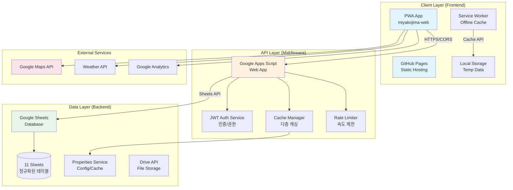
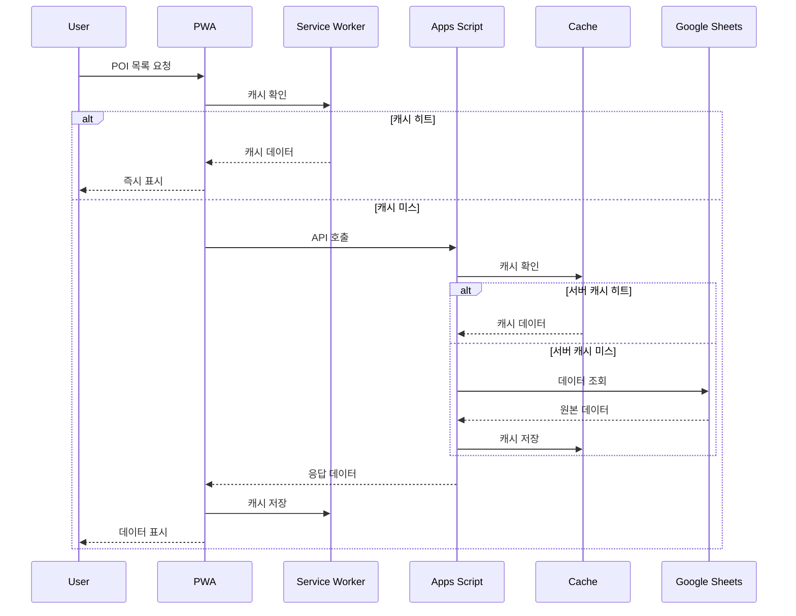
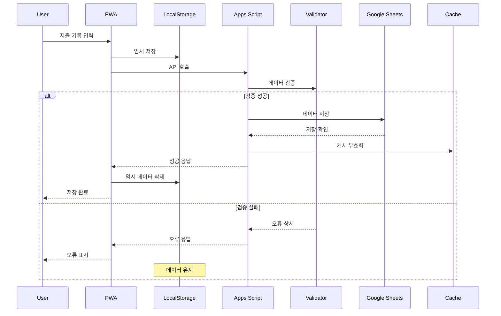
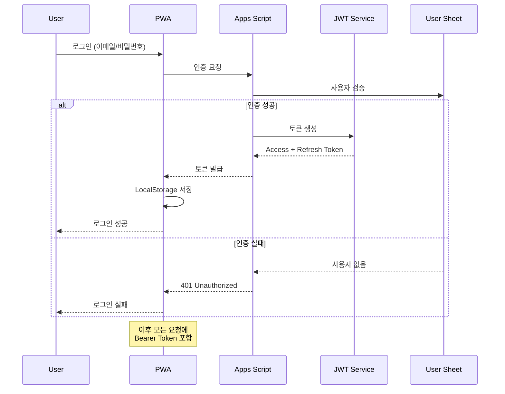
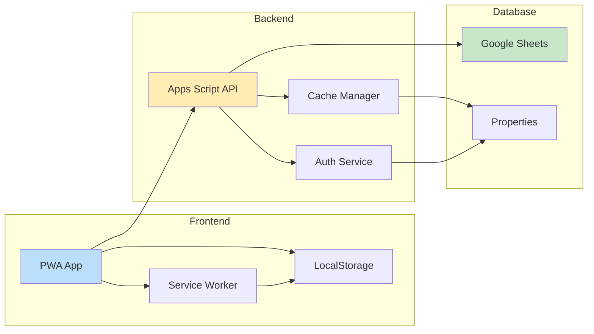
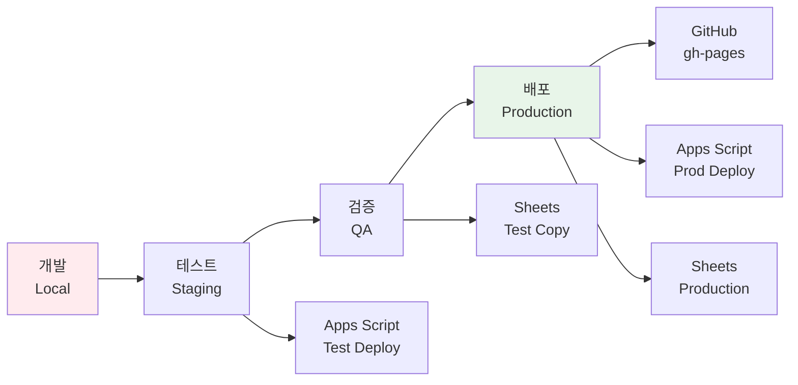
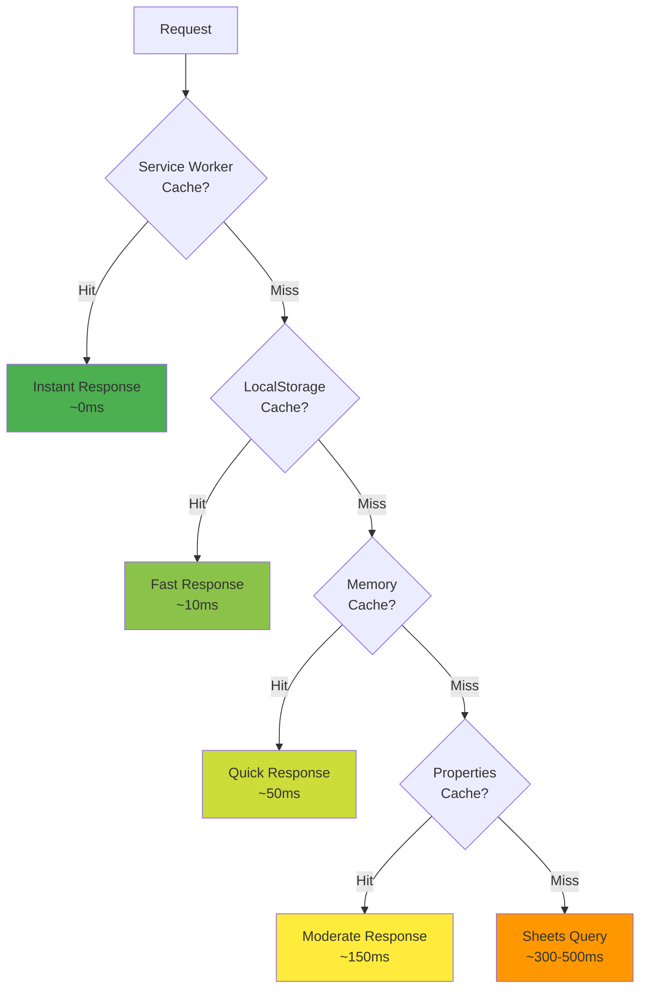
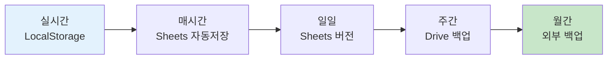
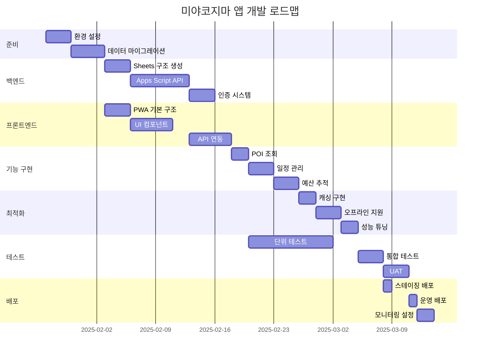
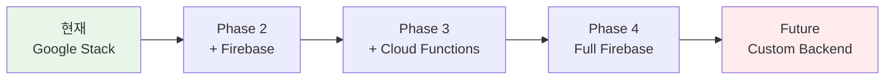

# 미야코지마 여행 앱 시스템 아키텍처 청사진

**버전**: 1.0  
**작성일**: 2025-01-25  
**작성자**: System Architecture Team  
**목적**: GitHub Pages, Google Apps Script, Google Sheets 통합 아키텍처

---

## 📋 목차
1. [개요](#1-개요)
2. [전체 시스템 아키텍처](#2-전체-시스템-아키텍처)
3. [데이터 흐름도](#3-데이터-흐름도)
4. [컴포넌트 간 상호작용](#4-컴포넌트-간-상호작용)
5. [기술 스택 상세](#5-기술-스택-상세)
6. [배포 아키텍처](#6-배포-아키텍처)
7. [보안 아키텍처](#7-보안-아키텍처)
8. [성능 및 확장성](#8-성능-및-확장성)
9. [재해 복구 계획](#9-재해-복구-계획)
10. [구현 로드맵](#10-구현-로드맵)

---

## 1. 개요

### 1.1 시스템 목표
- **비용 효율성**: 서버리스 아키텍처로 운영비 제로
- **접근성**: PWA 기반 크로스 플랫폼 지원
- **신뢰성**: 오프라인 우선 설계로 네트워크 독립성
- **확장성**: 2-3명에서 1000명까지 단계적 확장

### 1.2 핵심 원칙
- **Simple is Better**: 복잡한 인프라 대신 Google 생태계 활용
- **Offline First**: 네트워크 없이도 핵심 기능 동작
- **Data Integrity**: 다중 백업과 검증으로 데이터 보호
- **User Privacy**: 개인정보 최소 수집, 암호화 저장

---

## 2. 전체 시스템 아키텍처

### 2.1 3계층 아키텍처 다이어그램



### 2.2 계층별 역할

| 계층 | 구성요소 | 역할 | 기술 |
|------|---------|------|------|
| **프레젠테이션** | GitHub Pages | 정적 호스팅 | HTML/CSS/JS |
| | PWA App | 사용자 인터페이스 | Vanilla JS, ES6+ |
| | Service Worker | 오프라인 지원 | Cache API |
| **비즈니스 로직** | Apps Script | API 서버 | Google Apps Script |
| | Auth Service | 인증/권한 | JWT |
| | Cache Manager | 성능 최적화 | Memory + Properties |
| **데이터** | Google Sheets | 데이터베이스 | Sheets API |
| | Properties | 설정/캐시 | Properties Service |
| | Drive | 파일 저장 | Drive API |

---

## 3. 데이터 흐름도

### 3.1 읽기 작업 플로우



### 3.2 쓰기 작업 플로우



### 3.3 인증 플로우



---

## 4. 컴포넌트 간 상호작용

### 4.1 컴포넌트 의존성 매트릭스



### 4.2 인터페이스 정의

| 인터페이스 | 프로토콜 | 형식 | 보안 |
|------------|---------|------|------|
| PWA ↔ API | HTTPS | JSON | JWT + CORS |
| API ↔ Sheets | Sheets API | 2D Array | OAuth 2.0 |
| PWA ↔ Cache | Cache API | Response | Origin 격리 |
| API ↔ Properties | Properties API | Key-Value | Script 격리 |

---

## 5. 기술 스택 상세

### 5.1 프론트엔드 스택

```yaml
Core:
  Language: JavaScript ES6+
  Framework: Vanilla JS (No Framework)
  Build: None (Pure Static)
  
PWA:
  Manifest: manifest.json
  Service Worker: sw.js
  Icons: Adaptive Icons
  
UI/UX:
  CSS: Custom CSS3
  Design System: miyako-design-system.css
  Responsive: Mobile-First
  Accessibility: WCAG 2.1 AA
  
Performance:
  Loading: Progressive Enhancement
  Caching: Cache-First Strategy
  Optimization: Code Splitting
```

### 5.2 백엔드 스택

```yaml
Runtime:
  Platform: Google Apps Script
  Language: JavaScript (Rhino Engine)
  Version: ES5 + Some ES6
  
API:
  Type: RESTful Web App
  Auth: JWT (HS256)
  Format: JSON
  
Data Access:
  Primary: Google Sheets API
  Cache: PropertiesService
  Files: Drive API
  
Limitations:
  Execution Time: 6 minutes
  API Calls: 100/minute
  Response Size: 50MB
  Concurrent Users: 30
```

### 5.3 데이터베이스 스택

```yaml
Storage:
  Type: Google Sheets
  Structure: 11 Normalized Tables
  Size Limit: 10M cells total
  
Schema:
  Design: 3NF (Third Normal Form)
  Relations: Primary/Foreign Keys
  Indexes: Column-based
  
Access:
  Method: Sheets API v4
  Auth: Service Account
  Rate Limit: 100 req/100s
```

---

## 6. 배포 아키텍처

### 6.1 배포 다이어그램

```
┌─────────────────────────────────────────────┐
│          사용자 디바이스                      │
│  ┌─────────────────────────────────────┐    │
│  │     PWA (Cached)                    │    │
│  │  - HTML/CSS/JS                      │    │
│  │  - Service Worker                   │    │
│  │  - LocalStorage                     │    │
│  └─────────────────────────────────────┘    │
└─────────────────────────────────────────────┘
                    ↓ HTTPS
┌─────────────────────────────────────────────┐
│            GitHub Pages (CDN)                │
│  ┌─────────────────────────────────────┐    │
│  │  Repository: miyakojima-web         │    │
│  │  Branch: gh-pages                   │    │
│  │  Domain: username.github.io         │    │
│  └─────────────────────────────────────┘    │
└─────────────────────────────────────────────┘
                    ↓ API Calls
┌─────────────────────────────────────────────┐
│         Google Cloud Platform                │
│  ┌─────────────────────────────────────┐    │
│  │  Google Apps Script                 │    │
│  │  - Deployment ID: AKfycb...         │    │
│  │  - Version: Latest                  │    │
│  │  - Access: Anyone                   │    │
│  └─────────────────────────────────────┘    │
│  ┌─────────────────────────────────────┐    │
│  │  Google Sheets                      │    │
│  │  - Spreadsheet ID: 1a2b3c...        │    │
│  │  - 11 Sheets (Tables)               │    │
│  │  - Shared: Editor Access            │    │
│  └─────────────────────────────────────┘    │
└─────────────────────────────────────────────┘
```

### 6.2 배포 프로세스



### 6.3 환경별 설정

| 환경 | GitHub Pages | Apps Script | Google Sheets |
|------|-------------|-------------|---------------|
| **개발** | localhost:5000 | Dev Deployment | Test Sheet Copy |
| **스테이징** | staging branch | Test Deployment | Staging Sheet |
| **운영** | gh-pages branch | Prod Deployment | Production Sheet |

---

## 7. 보안 아키텍처

### 7.1 보안 계층

```
┌──────────────────────────────────────┐
│         Layer 4: 애플리케이션         │
│  - Input Validation                  │
│  - XSS Protection                    │
│  - CSRF Protection                   │
└──────────────────────────────────────┘
┌──────────────────────────────────────┐
│         Layer 3: 인증/권한           │
│  - JWT Authentication                │
│  - Role-Based Access                 │
│  - Token Expiration                  │
└──────────────────────────────────────┘
┌──────────────────────────────────────┐
│         Layer 2: 전송 보안           │
│  - HTTPS Only                        │
│  - CORS Policy                       │
│  - CSP Headers                       │
└──────────────────────────────────────┘
┌──────────────────────────────────────┐
│         Layer 1: 데이터 보안         │
│  - Encryption at Rest                │
│  - PII Masking                       │
│  - Audit Logging                     │
└──────────────────────────────────────┘
```

### 7.2 보안 체크리스트

#### 7.2.1 프론트엔드 보안
- [x] HTTPS 강제
- [x] Content Security Policy
- [x] XSS 방지 (innerHTML 금지)
- [x] 민감 데이터 LocalStorage 암호화
- [x] API 키 서버 보관

#### 7.2.2 API 보안
- [x] JWT 토큰 검증
- [x] Rate Limiting
- [x] Input Validation
- [x] SQL Injection 방지
- [x] CORS 화이트리스트

#### 7.2.3 데이터 보안
- [x] Google 계정 2단계 인증
- [x] Sheets 접근 권한 최소화
- [x] PII 마스킹 (여권번호 등)
- [x] 정기 백업
- [x] 감사 로그

### 7.3 인증/권한 매트릭스

| 역할 | POI 조회 | 일정 수정 | 예산 기록 | 관리 기능 |
|------|---------|----------|----------|-----------|
| Guest | ✅ | ❌ | ❌ | ❌ |
| User | ✅ | ✅ (본인) | ✅ (본인) | ❌ |
| Admin | ✅ | ✅ (전체) | ✅ (전체) | ✅ |

---

## 8. 성능 및 확장성

### 8.1 성능 목표

| 메트릭 | 목표 | 현재 | 측정 방법 |
|--------|------|------|-----------|
| FCP (First Contentful Paint) | < 1s | - | Lighthouse |
| LCP (Largest Contentful Paint) | < 2.5s | - | Lighthouse |
| TTI (Time to Interactive) | < 3.5s | - | Lighthouse |
| API Response Time | < 300ms | - | Custom Logging |
| Cache Hit Rate | > 85% | - | Analytics |
| Offline Functionality | > 95% | - | Service Worker |

### 8.2 캐싱 전략



### 8.3 확장성 계획

#### Phase 1: MVP (2-3 사용자)
```yaml
Users: 2-3
Requests/Day: ~500
Storage: < 1MB
Cost: $0
Infrastructure: 
  - Single Sheet
  - Basic Caching
  - No Monitoring
```

#### Phase 2: Small Group (10-20 사용자)
```yaml
Users: 10-20
Requests/Day: ~5,000
Storage: < 10MB
Cost: $0
Infrastructure:
  - Multiple Sheets
  - Enhanced Caching
  - Basic Monitoring
```

#### Phase 3: Medium Scale (100-200 사용자)
```yaml
Users: 100-200
Requests/Day: ~50,000
Storage: < 100MB
Cost: ~$10/month
Infrastructure:
  - Sheet Sharding
  - Redis Cache
  - APM Monitoring
  - CDN for Assets
```

#### Phase 4: Large Scale (1000+ 사용자)
```yaml
Users: 1000+
Requests/Day: ~500,000
Storage: > 1GB
Cost: ~$100/month
Infrastructure:
  - Migrate to Firestore
  - Cloud Functions
  - Global CDN
  - Full Monitoring Suite
```

### 8.4 병목 지점 및 해결책

| 병목 지점 | 임계값 | 해결책 |
|-----------|--------|--------|
| Apps Script 실행 시간 | 6분 | 배치 처리, 비동기 작업 |
| Sheets API 호출 | 100/분 | 캐싱, 배치 읽기 |
| Sheets 크기 | 1000만 셀 | 데이터 아카이빙 |
| 동시 사용자 | 30명 | 로드 밸런싱 |
| Properties 크기 | 500KB | 외부 캐시 |

---

## 9. 재해 복구 계획

### 9.1 백업 전략



### 9.2 복구 시나리오

| 시나리오 | RTO* | RPO** | 복구 절차 |
|----------|------|-------|-----------|
| 사용자 실수 | 5분 | 1시간 | Sheets 버전 복원 |
| Sheet 손상 | 30분 | 1일 | Drive 백업 복원 |
| 계정 해킹 | 2시간 | 1일 | Google 지원 + 백업 |
| 전체 장애 | 24시간 | 1주 | 외부 백업 복원 |

*RTO: Recovery Time Objective (복구 시간 목표)  
**RPO: Recovery Point Objective (복구 시점 목표)

### 9.3 모니터링 및 알림

```yaml
Monitoring:
  Uptime:
    - GitHub Pages Status
    - Apps Script Health Check
    - Sheets API Status
  
  Performance:
    - API Response Time
    - Error Rate
    - Cache Hit Rate
  
  Security:
    - Failed Login Attempts
    - Unusual Access Patterns
    - API Rate Limit Violations

Alerting:
  Channels:
    - Email: critical@example.com
    - Slack: #miyako-alerts
    - SMS: +82-10-xxxx-xxxx
  
  Thresholds:
    - Error Rate > 5%: Warning
    - Error Rate > 10%: Critical
    - Response Time > 1s: Warning
    - Response Time > 3s: Critical
```

### 9.4 비상 연락망

| 역할 | 담당자 | 연락처 | 우선순위 |
|------|--------|--------|----------|
| 시스템 관리자 | 김은태 | primary@example.com | 1차 |
| 백업 관리자 | 정유민 | backup@example.com | 2차 |
| Google 지원 | - | support.google.com | 3차 |

---

## 10. 구현 로드맵

### 10.1 개발 일정 (9주)



### 10.2 주차별 마일스톤

| 주차 | 마일스톤 | 산출물 | 완료 기준 |
|------|---------|--------|-----------|
| 1주 | 인프라 설정 | Sheets, Apps Script | 환경 구성 완료 |
| 2주 | 데이터 레이어 | 11개 시트 생성 | 데이터 마이그레이션 |
| 3주 | API 개발 | RESTful 엔드포인트 | Postman 테스트 |
| 4주 | 인증 시스템 | JWT 로그인 | 토큰 발급/검증 |
| 5주 | PWA 프론트엔드 | 기본 UI | 오프라인 동작 |
| 6주 | 핵심 기능 | POI, 일정, 예산 | CRUD 완성 |
| 7주 | 최적화 | 캐싱, 성능 | Lighthouse 90+ |
| 8주 | 테스트 | 테스트 완료 | 버그 0건 |
| 9주 | 배포 | 운영 환경 | 실사용 가능 |

### 10.3 체크포인트

#### Week 3: API 동작 확인
- [ ] GET /v1/pois 응답 확인
- [ ] JWT 토큰 발급 확인
- [ ] CORS 설정 확인

#### Week 6: 기능 완성도
- [ ] POI 조회 및 필터링
- [ ] 일정 CRUD
- [ ] 예산 기록 및 집계
- [ ] 오프라인 모드

#### Week 9: 운영 준비
- [ ] 성능 목표 달성
- [ ] 보안 점검 완료
- [ ] 백업 시스템 구축
- [ ] 모니터링 활성화

---

## 부록 A: 기술 결정 근거

### A.1 왜 Google 스택인가?

| 장점 | 단점 |
|------|------|
| ✅ 무료 (소규모) | ❌ 벤더 종속 |
| ✅ 별도 서버 불필요 | ❌ 제한사항 많음 |
| ✅ 자동 백업 | ❌ 커스터마이징 한계 |
| ✅ 쉬운 공유 | ❌ 성능 제약 |
| ✅ 빠른 프로토타이핑 | ❌ 확장성 한계 |

### A.2 대안 기술 비교

| 요구사항 | Google 스택 | Firebase | AWS | 자체 서버 |
|----------|------------|----------|-----|-----------|
| 초기 비용 | $0 | $0-25 | $5-50 | $20+ |
| 운영 복잡도 | 낮음 | 중간 | 높음 | 매우 높음 |
| 확장성 | 제한적 | 좋음 | 매우 좋음 | 무제한 |
| 개발 속도 | 매우 빠름 | 빠름 | 보통 | 느림 |
| 적합한 규모 | 1-100명 | 1-10만명 | 무제한 | 무제한 |

### A.3 마이그레이션 경로



---

## 부록 B: 개발 가이드

### B.1 프로젝트 구조

```
miyakojima-web/
├── index.html              # 메인 진입점
├── manifest.json           # PWA 설정
├── sw.js                   # Service Worker
├── css/
│   ├── miyako-design-system.css
│   └── main-optimized.css
├── js/
│   ├── main.js            # 앱 초기화
│   ├── api.js             # API 클라이언트
│   ├── services/
│   │   ├── auth.js        # 인증 서비스
│   │   ├── data.js        # 데이터 서비스
│   │   └── cache.js       # 캐시 관리
│   └── modules/
│       ├── poi.js         # POI 모듈
│       ├── itinerary.js   # 일정 모듈
│       └── budget.js      # 예산 모듈
├── docs/
│   ├── data_schema_ko.md
│   ├── api_specification_ko.md
│   └── architecture_blueprint_ko.md
└── NewData/               # 원본 데이터 (가공 필요)
```

### B.2 개발 환경 설정

```bash
# 1. 저장소 클론
git clone https://github.com/username/miyakojima-web.git
cd miyakojima-web

# 2. 로컬 서버 실행
python -m http.server 5000

# 3. Google Apps Script 설정
# - script.google.com 접속
# - 새 프로젝트 생성
# - 코드 복사
# - 배포 > 웹 앱으로 배포

# 4. Google Sheets 설정
# - sheets.google.com 접속
# - 데이터 스키마대로 시트 생성
# - Apps Script 권한 부여

# 5. 환경 변수 설정
# Apps Script > 프로젝트 설정 > 스크립트 속성
JWT_SECRET=your-secret-key
SHEETS_ID=your-spreadsheet-id
```

### B.3 테스트 전략

#### 단위 테스트
```javascript
// test/api.test.js
describe('API Client', () => {
  test('POI 조회', async () => {
    const pois = await api.getPOIs();
    expect(pois.items).toBeDefined();
    expect(pois.items.length).toBeGreaterThan(0);
  });
});
```

#### 통합 테스트
```javascript
// test/integration.test.js
describe('전체 플로우', () => {
  test('로그인 → POI 조회 → 일정 추가', async () => {
    await api.login('test@example.com', 'password');
    const pois = await api.getPOIs();
    const result = await api.addItineraryDetail({
      poi_id: pois.items[0].poi_id
    });
    expect(result.created).toBe(true);
  });
});
```

#### E2E 테스트
```javascript
// test/e2e.test.js
describe('사용자 시나리오', () => {
  test('여행 첫날 일정', async () => {
    await page.goto('http://localhost:5000');
    await page.click('#login-button');
    await page.fill('#email', 'test@example.com');
    await page.fill('#password', 'password');
    await page.click('#submit');
    await page.waitForSelector('#dashboard');
    // ... 시나리오 계속
  });
});
```

### B.4 CI/CD 파이프라인

```yaml
# .github/workflows/deploy.yml
name: Deploy to GitHub Pages

on:
  push:
    branches: [ main ]

jobs:
  deploy:
    runs-on: ubuntu-latest
    steps:
    - uses: actions/checkout@v2
    
    - name: Run Tests
      run: |
        npm install
        npm test
    
    - name: Build
      run: |
        npm run build
    
    - name: Deploy to GitHub Pages
      uses: peaceiris/actions-gh-pages@v3
      with:
        github_token: ${{ secrets.GITHUB_TOKEN }}
        publish_dir: ./dist
    
    - name: Deploy Apps Script
      run: |
        clasp push
        clasp deploy
```

---

## 부록 C: 운영 매뉴얼

### C.1 일일 체크리스트

- [ ] 오전 09:00: 시스템 상태 확인
- [ ] 오전 10:00: 전일 백업 확인
- [ ] 오후 02:00: 성능 메트릭 확인
- [ ] 오후 05:00: 에러 로그 확인
- [ ] 오후 06:00: 일일 백업 실행

### C.2 문제 해결 가이드

| 증상 | 가능한 원인 | 해결 방법 |
|------|------------|-----------|
| API 응답 없음 | Apps Script 중단 | 재배포 |
| 로그인 실패 | 토큰 만료 | 토큰 갱신 |
| 데이터 미표시 | 캐시 문제 | 캐시 삭제 |
| 느린 응답 | API 제한 | 대기 후 재시도 |
| 오프라인 미동작 | SW 미등록 | SW 재등록 |

### C.3 성능 튜닝 체크리스트

#### 프론트엔드 최적화
- [ ] 이미지 최적화 (WebP, lazy loading)
- [ ] CSS/JS 압축
- [ ] Critical CSS 인라인
- [ ] 폰트 최적화
- [ ] 불필요한 리소스 제거

#### API 최적화
- [ ] 배치 요청 구현
- [ ] 캐시 히트율 개선
- [ ] 쿼리 최적화
- [ ] 인덱스 추가
- [ ] 페이지네이션 구현

#### 데이터베이스 최적화
- [ ] 시트 크기 최적화
- [ ] 수식 복잡도 감소
- [ ] 불필요한 데이터 아카이빙
- [ ] 인덱스 컬럼 추가
- [ ] 조인 최소화

---

**문서 끝**

이 아키텍처 청사진은 미야코지마 여행 앱의 전체 시스템 구조와 구현 방법을 상세히 설명합니다. Google 생태계를 활용한 비용 효율적이고 확장 가능한 설계로, 핵심 사용자인 두 명에게 안정적이고 빠른 개인 맞춤형 경험을 제공하는 데 최적화되어 있습니다.