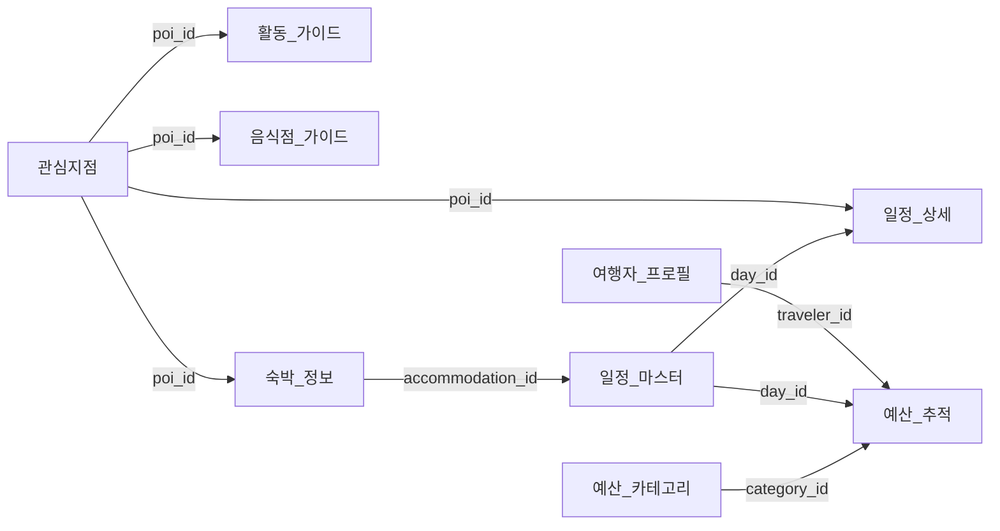

# 미야코지마 여행 앱 데이터 스키마 설계서

**버전**: 1.0  
**작성일**: 2025-01-25  
**작성자**: Backend Architecture Team  
**목적**: Google Sheets 기반 데이터 관리 시스템 구축

---

## 📋 목차
1. [개요](#1-개요)
2. [설계 원칙](#2-설계-원칙)
3. [시트 구조](#3-시트-구조)
4. [상세 스키마](#4-상세-스키마)
5. [관계 정의](#5-관계-정의)
6. [데이터 변환 규칙](#6-데이터-변환-규칙)
7. [인덱싱 전략](#7-인덱싱-전략)
8. [구현 로드맵](#8-구현-로드맵)

---

## 1. 개요

### 1.1 배경
미야코지마 여행 앱의 모든 데이터를 Google Sheets에서 효율적으로 관리하기 위한 스키마 설계. 원본 JSON 데이터를 가공하여 관계형 구조로 재구성.

### 1.2 데이터 소스
```
NewData/
├── core_data/       # 핵심 여행 데이터
├── data/            # POI 마스터 데이터  
└── knowledge/       # 가이드 및 참조 정보
```

### 1.3 목표
- **데이터 정규화**: 중복 제거 및 일관성 보장
- **성능 최적화**: 빠른 읽기/쓰기 처리
- **확장성**: 새로운 기능 추가 용이
- **무결성**: 데이터 정확성 및 완전성 보장

---

## 2. 설계 원칙

### 2.1 핵심 원칙
1. **가공 우선**: 원본 데이터 직접 참조 금지 (README.md 지침)
2. **정규화**: 3차 정규형(3NF) 준수
3. **단순성**: Google Sheets 제약사항 고려
4. **실시간성**: 여행 중 즉시 업데이트 가능

### 2.2 Google Sheets 제약사항
- 최대 1,000만 셀 (행 × 열)
- 단일 시트 최대 500만 셀
- 수식 복잡도 제한
- API 호출 속도 제한 (분당 100회)

---

## 3. 시트 구조

### 3.1 전체 구조도
```
Google Sheets 워크북
│
├── 📊 마스터 데이터 (읽기 전용)
│   ├── 여행자_프로필
│   ├── 관심지점 (POI)
│   ├── 일정_마스터
│   └── 예산_카테고리
│
├── 📝 트랜잭션 데이터 (읽기/쓰기)
│   ├── 일정_상세
│   ├── 예산_추적
│   ├── 활동_가이드
│   └── 음식점_가이드
│
└── 📚 참조 데이터 (읽기 전용)
    ├── 교통_정보
    ├── 숙박_정보
    └── 가격_참조
```

### 3.2 시트별 용도

| 시트명 | 용도 | 데이터 소스 | 권한 |
|--------|------|------------|------|
| 여행자_프로필 | 여행자 기본 정보 | traveler_profile.json | R |
| 관심지점 | POI 마스터 데이터 | miyakojima_pois.json | R |
| 일정_마스터 | 일별 주요 일정 | itinerary_master.json | R/W |
| 일정_상세 | 시간대별 세부 일정 | itinerary_master.json | R/W |
| 예산_카테고리 | 예산 분류 체계 | budget_tracker.json | R |
| 예산_추적 | 실제 지출 기록 | budget_tracker.json | R/W |
| 활동_가이드 | 액티비티 정보 | activities_guide.json | R |
| 음식점_가이드 | 레스토랑 정보 | dining_guide.json | R |
| 교통_정보 | 렌트카, 대중교통 | travel_logistics.json | R |
| 숙박_정보 | 호텔, 숙소 정보 | travel_logistics.json | R |
| 가격_참조 | 표준 가격 정보 | budget_tracker.json | R |

---

## 4. 상세 스키마

### 4.1 여행자_프로필 (Traveler_Profile)

| 컬럼명 | 데이터 타입 | 제약조건 | 설명 | 예시 |
|--------|------------|----------|------|------|
| traveler_id | TEXT | PRIMARY KEY | 여행자 고유 ID | "T001" |
| name_ko | TEXT | NOT NULL | 한글 이름 | "김은태" |
| name_en | TEXT | | 영문 이름 | "Euntae Kim" |
| role | TEXT | | 역할 | "메인 플래너" |
| phone | TEXT | | 연락처 | "010-1234-5678" |
| email | TEXT | | 이메일 | "fenomeno@example.com" |
| preferences | TEXT | | 선호사항 JSON | '{"식사":"해산물","활동":"스노클링"}' |
| emergency_contact | TEXT | | 비상연락처 | "010-8765-4321" |
| passport_no | TEXT | | 여권번호 | "M12345678" |
| created_at | DATETIME | DEFAULT NOW() | 생성일시 | "2025-01-25 10:00:00" |

### 4.2 관심지점 (POI_Master)

| 컬럼명 | 데이터 타입 | 제약조건 | 설명 | 예시 |
|--------|------------|----------|------|------|
| poi_id | TEXT | PRIMARY KEY | POI 고유 ID | "POI001" |
| name_ko | TEXT | NOT NULL | 한글명 | "요나하 마에하마 해변" |
| name_local | TEXT | | 현지명 | "Yonaha Maehama Beach" |
| category_primary | TEXT | NOT NULL | 주 카테고리 | "자연·전망" |
| category_secondary | TEXT | | 부 카테고리 | "해변" |
| island | TEXT | | 섬 이름 | "시모지시마" |
| lat | DECIMAL(10,8) | NOT NULL | 위도 | 24.7349726 |
| lng | DECIMAL(11,8) | NOT NULL | 경도 | 125.2629745 |
| address | TEXT | | 주소 | "Yonaha, Shimoji..." |
| phone | TEXT | | 전화번호 | "0980-76-2177" |
| opening_hours | TEXT | | 영업시간 | "24시간" |
| price_level | TEXT | | 가격대 | "무료" |
| rating | DECIMAL(2,1) | | 평점 | 4.5 |
| visit_duration | TEXT | | 추천 체류시간 | "2-3시간" |
| parking_available | BOOLEAN | | 주차 가능 | TRUE |
| must_visit | BOOLEAN | | 필수 방문지 | TRUE |
| notes | TEXT | | 메모 | "일몰 명소" |

### 4.3 일정_마스터 (Itinerary_Master)

| 컬럼명 | 데이터 타입 | 제약조건 | 설명 | 예시 |
|--------|------------|----------|------|------|
| day_id | TEXT | PRIMARY KEY | 일자 ID | "D01" |
| date | DATE | NOT NULL | 날짜 | "2025-09-27" |
| day_number | INTEGER | NOT NULL | 여행 일차 | 1 |
| theme | TEXT | | 일일 테마 | "도착 & 휴식" |
| accommodation_id | TEXT | FOREIGN KEY | 숙박 ID | "H001" |
| primary_area | TEXT | | 주요 활동지역 | "히라라 시내" |
| weather_forecast | TEXT | | 날씨 예보 | "맑음" |
| sunrise | TIME | | 일출 시간 | "06:30" |
| sunset | TIME | | 일몰 시간 | "18:45" |
| high_tide | TIME | | 만조 시간 | "10:30" |
| low_tide | TIME | | 간조 시간 | "16:20" |
| notes | TEXT | | 일일 메모 | "렌트카 픽업" |

### 4.4 일정_상세 (Itinerary_Detail)

| 컬럼명 | 데이터 타입 | 제약조건 | 설명 | 예시 |
|--------|------------|----------|------|------|
| detail_id | TEXT | PRIMARY KEY | 상세 ID | "D01-001" |
| day_id | TEXT | FOREIGN KEY | 일자 ID | "D01" |
| sequence | INTEGER | NOT NULL | 순서 | 1 |
| time_start | TIME | | 시작 시간 | "09:00" |
| time_end | TIME | | 종료 시간 | "10:30" |
| poi_id | TEXT | FOREIGN KEY | POI ID | "POI001" |
| activity_type | TEXT | | 활동 유형 | "관광" |
| transportation | TEXT | | 이동 수단 | "렌트카" |
| distance_km | DECIMAL(5,2) | | 이동 거리 | 15.5 |
| duration_minutes | INTEGER | | 소요 시간 | 90 |
| cost_jpy | INTEGER | | 예상 비용 | 0 |
| status | TEXT | | 상태 | "예정" |
| actual_time_start | TIME | | 실제 시작 | |
| actual_time_end | TIME | | 실제 종료 | |
| actual_cost_jpy | INTEGER | | 실제 비용 | |
| notes | TEXT | | 메모 | "사진 촬영 포인트" |

### 4.5 예산_카테고리 (Budget_Category)

| 컬럼명 | 데이터 타입 | 제약조건 | 설명 | 예시 |
|--------|------------|----------|------|------|
| category_id | TEXT | PRIMARY KEY | 카테고리 ID | "CAT001" |
| category_name_ko | TEXT | NOT NULL | 한글명 | "식사" |
| category_name_en | TEXT | | 영문명 | "Dining" |
| parent_category | TEXT | | 상위 카테고리 | NULL |
| icon | TEXT | | 아이콘 | "🍽️" |
| color_code | TEXT | | 색상 코드 | "#FF5722" |
| budget_limit_jpy | INTEGER | | 예산 한도 | 50000 |
| priority | INTEGER | | 우선순위 | 1 |
| is_active | BOOLEAN | DEFAULT TRUE | 활성 상태 | TRUE |

### 4.6 예산_추적 (Budget_Tracking)

| 컬럼명 | 데이터 타입 | 제약조건 | 설명 | 예시 |
|--------|------------|----------|------|------|
| expense_id | TEXT | PRIMARY KEY | 지출 ID | "EXP001" |
| day_id | TEXT | FOREIGN KEY | 일자 ID | "D01" |
| category_id | TEXT | FOREIGN KEY | 카테고리 ID | "CAT001" |
| poi_id | TEXT | FOREIGN KEY | POI ID | "POI015" |
| timestamp | DATETIME | NOT NULL | 지출 시각 | "2025-09-27 12:30:00" |
| amount_jpy | DECIMAL(10,2) | NOT NULL | 금액(엔) | 3500 |
| amount_krw | DECIMAL(10,2) | | 금액(원) | 32000 |
| exchange_rate | DECIMAL(6,2) | | 환율 | 9.14 |
| payment_method | TEXT | | 결제 수단 | "현금" |
| description | TEXT | | 설명 | "점심 식사" |
| receipt_photo | TEXT | | 영수증 URL | "https://..." |
| shared_with | TEXT | | 공유 대상 | "전체" |
| tags | TEXT | | 태그 | "맛집,추천" |
| is_planned | BOOLEAN | | 계획된 지출 | FALSE |
| created_by | TEXT | | 입력자 | "T001" |
| created_at | DATETIME | DEFAULT NOW() | 생성일시 | "2025-09-27 12:35:00" |

### 4.7 활동_가이드 (Activity_Guide)

| 컬럼명 | 데이터 타입 | 제약조건 | 설명 | 예시 |
|--------|------------|----------|------|------|
| activity_id | TEXT | PRIMARY KEY | 활동 ID | "ACT001" |
| poi_id | TEXT | FOREIGN KEY | POI ID | "POI030" |
| name_ko | TEXT | NOT NULL | 활동명 | "야비지 보트 투어" |
| category | TEXT | | 카테고리 | "해양 액티비티" |
| duration_hours | DECIMAL(3,1) | | 소요 시간 | 4.0 |
| price_adult_jpy | INTEGER | | 성인 가격 | 14000 |
| price_child_jpy | INTEGER | | 아동 가격 | 7000 |
| min_participants | INTEGER | | 최소 인원 | 2 |
| max_participants | INTEGER | | 최대 인원 | 20 |
| reservation_required | BOOLEAN | | 예약 필수 | TRUE |
| reservation_deadline | TEXT | | 예약 마감 | "1일전" |
| included_items | TEXT | | 포함 사항 | "스노클링 장비, 점심" |
| requirements | TEXT | | 필수 조건 | "수영 가능자" |
| best_season | TEXT | | 최적 시즌 | "4-10월" |
| cancellation_policy | TEXT | | 취소 정책 | "24시간 전 무료" |
| provider_name | TEXT | | 업체명 | "미야코 마린" |
| provider_phone | TEXT | | 업체 연락처 | "0980-76-3000" |

### 4.8 음식점_가이드 (Restaurant_Guide)

| 컬럼명 | 데이터 타입 | 제약조건 | 설명 | 예시 |
|--------|------------|----------|------|------|
| restaurant_id | TEXT | PRIMARY KEY | 식당 ID | "REST001" |
| poi_id | TEXT | FOREIGN KEY | POI ID | "POI045" |
| name_ko | TEXT | NOT NULL | 한글명 | "코지 소바" |
| cuisine_type | TEXT | | 음식 종류 | "오키나와 소바" |
| price_range_min | INTEGER | | 최소 가격 | 500 |
| price_range_max | INTEGER | | 최대 가격 | 1500 |
| signature_menu | TEXT | | 대표 메뉴 | "소키 소바" |
| business_hours | TEXT | | 영업 시간 | "11:00-21:00" |
| closed_days | TEXT | | 휴무일 | "화요일" |
| seats | INTEGER | | 좌석 수 | 30 |
| reservation_available | BOOLEAN | | 예약 가능 | FALSE |
| parking_spaces | INTEGER | | 주차 대수 | 5 |
| english_menu | BOOLEAN | | 영문 메뉴 | TRUE |
| vegetarian_options | BOOLEAN | | 채식 옵션 | TRUE |
| kid_friendly | BOOLEAN | | 아동 친화 | TRUE |
| payment_cards | BOOLEAN | | 카드 결제 | TRUE |
| payment_ic | BOOLEAN | | IC카드 결제 | FALSE |
| avg_wait_time | INTEGER | | 평균 대기시간(분) | 15 |
| tabelog_rating | DECIMAL(2,1) | | 타베로그 평점 | 3.8 |
| google_rating | DECIMAL(2,1) | | 구글 평점 | 4.2 |

### 4.9 교통_정보 (Transportation_Info)

| 컬럼명 | 데이터 타입 | 제약조건 | 설명 | 예시 |
|--------|------------|----------|------|------|
| transport_id | TEXT | PRIMARY KEY | 교통 ID | "TRN001" |
| type | TEXT | NOT NULL | 교통 유형 | "렌트카" |
| provider | TEXT | | 제공업체 | "타임스 렌터카" |
| reservation_no | TEXT | | 예약번호 | "MV000561070" |
| pickup_location | TEXT | | 픽업 장소 | "미야코 공항" |
| pickup_datetime | DATETIME | | 픽업 일시 | "2025-09-27 14:00" |
| return_location | TEXT | | 반납 장소 | "미야코 공항" |
| return_datetime | DATETIME | | 반납 일시 | "2025-10-01 12:00" |
| vehicle_model | TEXT | | 차량 모델 | "닛산 노트" |
| daily_rate_jpy | INTEGER | | 일일 요금 | 5000 |
| insurance_jpy | INTEGER | | 보험료 | 1500 |
| total_cost_jpy | INTEGER | | 총 비용 | 25000 |
| fuel_policy | TEXT | | 연료 정책 | "만탱 반납" |
| mileage_limit | TEXT | | 주행 제한 | "무제한" |
| driver_license | TEXT | | 필요 면허 | "국제면허증" |
| notes | TEXT | | 메모 | "네비게이션 포함" |

### 4.10 숙박_정보 (Accommodation_Info)

| 컬럼명 | 데이터 타입 | 제약조건 | 설명 | 예시 |
|--------|------------|----------|------|------|
| accommodation_id | TEXT | PRIMARY KEY | 숙박 ID | "H001" |
| poi_id | TEXT | FOREIGN KEY | POI ID | "POI080" |
| name_ko | TEXT | NOT NULL | 한글명 | "힐튼 미야코지마" |
| type | TEXT | | 숙박 유형 | "리조트" |
| check_in_date | DATE | | 체크인 날짜 | "2025-09-27" |
| check_out_date | DATE | | 체크아웃 날짜 | "2025-09-28" |
| room_type | TEXT | | 객실 유형 | "오션뷰 트윈" |
| guests | INTEGER | | 투숙 인원 | 2 |
| total_nights | INTEGER | | 총 박수 | 1 |
| rate_per_night_jpy | INTEGER | | 1박 요금 | 35000 |
| total_cost_krw | INTEGER | | 총 비용(원) | 667862 |
| breakfast_included | BOOLEAN | | 조식 포함 | TRUE |
| dinner_included | BOOLEAN | | 석식 포함 | TRUE |
| reservation_no | TEXT | | 예약번호 | "HLT123456" |
| payment_status | TEXT | | 결제 상태 | "완료" |
| cancellation_deadline | DATE | | 취소 마감 | "2025-09-25" |
| check_in_time | TIME | | 체크인 시간 | "15:00" |
| check_out_time | TIME | | 체크아웃 시간 | "11:00" |
| amenities | TEXT | | 편의시설 | "수영장,스파,피트니스" |
| parking_free | BOOLEAN | | 무료 주차 | TRUE |

### 4.11 가격_참조 (Price_Reference)

| 컬럼명 | 데이터 타입 | 제약조건 | 설명 | 예시 |
|--------|------------|----------|------|------|
| price_id | TEXT | PRIMARY KEY | 가격 ID | "PRC001" |
| category | TEXT | NOT NULL | 카테고리 | "식사" |
| subcategory | TEXT | | 세부 카테고리 | "소바" |
| item_name_ko | TEXT | NOT NULL | 품목명 | "미야코 소바" |
| price_min_jpy | INTEGER | | 최저가 | 580 |
| price_max_jpy | INTEGER | | 최고가 | 800 |
| price_avg_jpy | INTEGER | | 평균가 | 690 |
| unit | TEXT | | 단위 | "1인분" |
| location_type | TEXT | | 장소 유형 | "로컬 식당" |
| season | TEXT | | 시즌 | "연중" |
| last_updated | DATE | | 최종 업데이트 | "2025-01-20" |
| source | TEXT | | 출처 | "현지 조사" |
| notes | TEXT | | 메모 | "관광지는 10-20% 비쌈" |

---

## 5. 관계 정의

### 5.1 Primary Key - Foreign Key 관계



### 5.2 관계 설명

| 부모 테이블 | 자식 테이블 | 관계 | 설명 |
|------------|------------|------|------|
| 여행자_프로필 | 예산_추적 | 1:N | 한 여행자가 여러 지출 기록 |
| 관심지점 | 일정_상세 | 1:N | 한 POI가 여러 일정에 포함 |
| 관심지점 | 활동_가이드 | 1:1 | POI와 활동 정보 연결 |
| 관심지점 | 음식점_가이드 | 1:1 | POI와 식당 정보 연결 |
| 일정_마스터 | 일정_상세 | 1:N | 하루에 여러 세부 일정 |
| 일정_마스터 | 예산_추적 | 1:N | 하루에 여러 지출 |
| 예산_카테고리 | 예산_추적 | 1:N | 한 카테고리에 여러 지출 |

---

## 6. 데이터 변환 규칙

### 6.1 JSON → Google Sheets 변환

#### 6.1.1 중첩 객체 처리
```javascript
// 원본 JSON
{
  "payment": {
    "cards": true,
    "ic": false,
    "cash_only": true
  }
}

// 변환 후 (평면화)
payment_cards: TRUE
payment_ic: FALSE
payment_cash_only: TRUE
```

#### 6.1.2 배열 처리
```javascript
// 원본 JSON
{
  "categories": ["해변", "일몰 명소", "수영"]
}

// 변환 후 (구분자 사용)
categories: "해변|일몰 명소|수영"
```

#### 6.1.3 날짜/시간 변환
```javascript
// 원본: ISO 8601
"2025-09-27T14:00:00Z"

// 변환 후
date: "2025-09-27"
time: "14:00:00"
```

### 6.2 데이터 타입 매핑

| JSON 타입 | Google Sheets 타입 | 변환 규칙 |
|-----------|-------------------|-----------|
| string | TEXT | 그대로 유지 |
| number | NUMBER/DECIMAL | 소수점 자리수 확인 |
| boolean | BOOLEAN | TRUE/FALSE |
| null | 빈 셀 | 공백 처리 |
| array | TEXT | 파이프(|) 구분 |
| object | TEXT | JSON 문자열화 |

### 6.3 데이터 가공 규칙

#### 6.3.1 ID 생성
- 패턴: `[타입코드][일련번호]`
- 예시: POI001, D01-001, EXP001

#### 6.3.2 좌표 정밀도
- 위도: 소수점 8자리
- 경도: 소수점 8자리

#### 6.3.3 금액 처리
- 기본 통화: JPY (일본 엔)
- 환율 적용시 별도 컬럼 추가
- 소수점: 정수 처리 (반올림)

---

## 7. 인덱싱 전략

### 7.1 Primary 인덱스

| 시트 | 인덱스 컬럼 | 용도 |
|------|------------|------|
| 관심지점 | poi_id | 고유 식별 |
| 일정_마스터 | day_id | 일자별 조회 |
| 예산_추적 | expense_id | 지출 조회 |
| 여행자_프로필 | traveler_id | 사용자 식별 |

### 7.2 Secondary 인덱스

| 시트 | 인덱스 컬럼 | 용도 |
|------|------------|------|
| 관심지점 | category_primary, island | 카테고리별 필터링 |
| 일정_상세 | day_id, sequence | 일정 순서 조회 |
| 예산_추적 | day_id, category_id | 일별/카테고리별 집계 |
| 음식점_가이드 | cuisine_type, price_range_min | 음식 종류/가격대 검색 |

### 7.3 복합 인덱스

```sql
-- 일정 조회 최적화
CREATE INDEX idx_itinerary ON 일정_상세(day_id, sequence, poi_id);

-- 예산 분석 최적화  
CREATE INDEX idx_budget ON 예산_추적(day_id, category_id, amount_jpy);

-- POI 검색 최적화
CREATE INDEX idx_poi_search ON 관심지점(category_primary, island, must_visit);
```

---

## 8. 구현 로드맵

### 8.1 Phase 1: 기본 구조 (Week 1)
- [ ] Google Sheets 워크북 생성
- [ ] 11개 시트 구조 설정
- [ ] 컬럼 헤더 정의
- [ ] 데이터 타입 설정
- [ ] Primary Key 설정

### 8.2 Phase 2: 데이터 마이그레이션 (Week 2)
- [ ] JSON 파서 개발
- [ ] 데이터 변환 스크립트
- [ ] 가공 규칙 적용
- [ ] 초기 데이터 로드
- [ ] 데이터 검증

### 8.3 Phase 3: 관계 설정 (Week 3)
- [ ] Foreign Key 관계 구현
- [ ] VLOOKUP 수식 설정
- [ ] QUERY 함수 구성
- [ ] 데이터 무결성 검증
- [ ] 참조 무결성 테스트

### 8.4 Phase 4: API 연동 (Week 4)
- [ ] Google Apps Script 개발
- [ ] CRUD 엔드포인트 구현
- [ ] 인증/권한 설정
- [ ] 응답 캐싱 구현
- [ ] 성능 최적화

### 8.5 Phase 5: 최적화 (Week 5)
- [ ] 인덱스 성능 튜닝
- [ ] 쿼리 최적화
- [ ] 캐시 전략 구현
- [ ] 배치 처리 최적화
- [ ] 모니터링 설정

---

## 부록 A: Google Sheets 함수 예시

### A.1 일정별 예산 집계
```excel
=QUERY(예산_추적!A:N, 
  "SELECT B, SUM(F) 
   WHERE B = 'D01' 
   GROUP BY B 
   LABEL SUM(F) '총 지출'", 1)
```

### A.2 카테고리별 지출 분석
```excel
=QUERY(예산_추적!A:N,
  "SELECT C, COUNT(A), SUM(F), AVG(F)
   GROUP BY C
   ORDER BY SUM(F) DESC
   LABEL C '카테고리', COUNT(A) '건수', SUM(F) '총액', AVG(F) '평균'", 1)
```

### A.3 POI 방문 체크
```excel
=VLOOKUP(E5, 관심지점!A:Q, 2, FALSE)
```

### A.4 일정 타임라인 생성
```excel
=SORT(FILTER(일정_상세!A:O, 일정_상세!B:B = "D01"), 3, TRUE)
```

---

## 부록 B: 데이터 품질 관리

### B.1 데이터 검증 규칙
- NOT NULL 체크
- UNIQUE 제약조건
- 참조 무결성
- 범위 체크 (날짜, 금액)
- 형식 검증 (이메일, 전화번호)

### B.2 에러 처리
- 중복 데이터 방지
- 누락 데이터 알림
- 형식 오류 자동 수정
- 트랜잭션 롤백

### B.3 백업 전략
- 일일 자동 백업
- 버전 관리
- 변경 이력 추적
- 복구 시나리오

---

## 부록 C: 보안 고려사항

### C.1 접근 권한
- 읽기 전용 시트 보호
- 사용자별 권한 설정
- API 키 보안 관리

### C.2 개인정보 보호
- 여권번호 암호화
- 연락처 마스킹
- GDPR 준수

### C.3 감사 로그
- 데이터 변경 추적
- 접근 기록 저장
- 이상 활동 모니터링

---

**문서 끝**

이 스키마는 미야코지마 여행 앱의 모든 데이터를 효과적으로 관리할 수 있도록 설계되었습니다. 원본 JSON 데이터를 가공하여 Google Sheets에서 최적의 성능을 발휘할 수 있는 구조로 변환합니다.