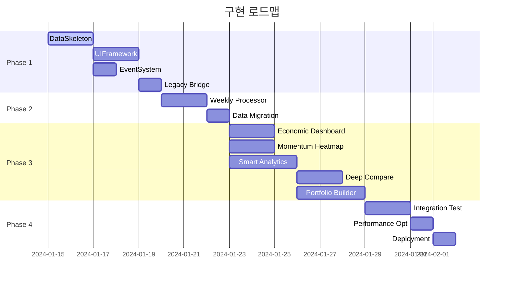

# 🗺️ Stock Analyzer Global Expansion 구현 로드맵

## 📅 전체 일정 (3주)



## 🎯 Phase 1: Core Foundation (Day 1-6)

### Day 1-2: DataSkeleton 구현
```javascript
// 📁 core/DataSkeleton.js
export default class DataSkeleton {
    // 우선순위 1: 데이터 교체 파이프라인
    async replaceWeeklyData(csvData) {
        // Step 1: CSV 정제 (0-0x2a0x2a 제거)
        // Step 2: 스키마 자동 감지
        // Step 3: 필드 매핑
        // Step 4: 검증 및 저장
        // Step 5: 구독자 알림
    }

    // 우선순위 2: 쿼리 시스템
    query(options) {
        // 필터링, 정렬, 페이징
    }

    // 우선순위 3: 구독 시스템
    subscribe(callback, options) {
        // 실시간 데이터 바인딩
    }
}

// ✅ Day 1 완료 기준
- [ ] CSV 정제 시스템 작동
- [ ] 스키마 자동 감지 완성
- [ ] 기본 쿼리 기능 구현

// ✅ Day 2 완료 기준
- [ ] 구독 시스템 완성
- [ ] 캐싱 시스템 구현
- [ ] 단위 테스트 통과
```

### Day 3-4: UIFramework 구현
```javascript
// 📁 core/UIFramework.js
export default class UIFramework {
    // 우선순위 1: 컴포넌트 팩토리
    createComponent(type, config) {
        // Chart, Table, Filter 생성
    }

    // 우선순위 2: 반응형 레이아웃
    createResponsiveLayout(config) {
        // 모바일/태블릿/데스크톱 적응
    }

    // 우선순위 3: 테마 시스템
    applyTheme(themeName) {
        // 다크모드 지원
    }
}

// ✅ Day 3 완료 기준
- [ ] 기본 컴포넌트 팩토리 구현
- [ ] Chart.js 통합
- [ ] 데이터 바인딩 구현

// ✅ Day 4 완료 기준
- [ ] 반응형 시스템 완성
- [ ] 테마 시스템 구현
- [ ] 컴포넌트 라이프사이클 완성
```

### Day 5: EventSystem 구현
```javascript
// 📁 core/EventSystem.js
export default class EventSystem {
    // 우선순위 1: 이벤트 버스
    emit(eventName, payload) {
        // 이벤트 발행
    }

    on(eventName, handler) {
        // 이벤트 구독
    }

    // 우선순위 2: 에러 격리
    handleError(error, event) {
        // 에러 처리 및 복구
    }
}

// ✅ Day 5 완료 기준
- [ ] 이벤트 버스 구현
- [ ] 우선순위 큐 시스템
- [ ] 에러 격리 메커니즘
- [ ] 디버깅 도구
```

### Day 6: Legacy Bridge 구현
```javascript
// 📁 core/LegacyBridge.js
export default class LegacyBridge {
    // 기존 매니저 래핑
    wrapLegacyManager(manager) {
        // 기존 시스템과 호환
    }

    // 데이터 변환
    convertLegacyData(data) {
        // 구 형식 → 신 형식
    }
}

// ✅ Day 6 완료 기준
- [ ] 기존 시스템 연결
- [ ] 데이터 형식 변환
- [ ] 이벤트 프록시
- [ ] 회귀 테스트 통과
```

## 🔧 Phase 2: Automation (Day 7-9)

### Day 7-8: Weekly Data Processor
```python
# 📁 automation/WeeklyDataProcessor.py
class WeeklyDataProcessor:
    def __init__(self):
        self.cleaner = DataCleaner()
        self.validator = SchemaValidator()

    def process_weekly_csv(self, csv_path):
        """원클릭 주간 데이터 처리"""
        # 1. CSV 로드 및 정제
        # 2. 0-0x2a0x2a 패턴 제거
        # 3. 스키마 검증
        # 4. JSON 변환
        # 5. 품질 리포트 생성

# ✅ Day 7-8 완료 기준
- [ ] CSV → JSON 자동 변환
- [ ] 데이터 정제 파이프라인
- [ ] 검증 시스템
- [ ] 에러 리포트
- [ ] 원클릭 실행 스크립트
```

### Day 9: Data Migration
```javascript
// 📁 tools/DataMigrator.js
export default class DataMigrator {
    // 기존 데이터 마이그레이션
    async migrate() {
        // enhanced_summary_data.json → DataSkeleton
    }
}

// ✅ Day 9 완료 기준
- [ ] 기존 데이터 마이그레이션
- [ ] 백업 시스템
- [ ] 롤백 메커니즘
```

## 🎨 Phase 3: Module Development (Day 10-17)

### Day 10-11: Economic Dashboard
```javascript
// 📁 modules/EconomicDashboard/
class EconomicDashboard {
    // TED 스프레드 차트
    renderTEDSpread() {}

    // 하이일드 스프레드
    renderHighYieldSpread() {}

    // 국채금리 곡선
    renderYieldCurve() {}
}

// ✅ 완료 기준
- [ ] 실시간 차트 렌더링
- [ ] 경제지표 알림
- [ ] 반응형 레이아웃
```

### Day 12-13: Momentum Heatmap
```javascript
// 📁 modules/MomentumHeatmap/
class MomentumHeatmap {
    // D3.js 트리맵
    renderTreemap() {}

    // 드릴다운 인터랙션
    enableDrilldown() {}

    // 기간 필터링
    filterByPeriod() {}
}

// ✅ 완료 기준
- [ ] 인터랙티브 히트맵
- [ ] 업종/국가별 뷰
- [ ] 부드러운 애니메이션
```

### 병렬 개발 (Gemini/Codex)
```
Day 10-12: SmartAnalytics (Gemini)
Day 13-14: DeepCompare (Gemini)
Day 10-13: PortfolioBuilder (Codex)
Day 14-17: Testing Suite (Codex)
```

## 🧪 Phase 4: Integration & Testing (Day 18-21)

### Day 18-19: Integration Testing
```javascript
// 📁 tests/integration/
describe('System Integration', () => {
    test('데이터 교체 → UI 갱신', () => {});
    test('모듈 간 통신', () => {});
    test('에러 격리', () => {});
    test('성능 기준 충족', () => {});
});

// ✅ 완료 기준
- [ ] 모든 통합 테스트 통과
- [ ] 성능 벤치마크 달성
- [ ] 메모리 누수 없음
```

### Day 20: Performance Optimization
```javascript
// 최적화 목표
- 초기 로딩: 10초 → 5초
- 차트 렌더링: 1초 → 500ms
- 메모리 사용: 1GB → 500MB

// 최적화 기법
- [ ] Code Splitting
- [ ] Lazy Loading
- [ ] Virtual Scrolling
- [ ] Web Workers
- [ ] Caching Strategy
```

### Day 21: Production Deployment
```bash
# 배포 체크리스트
- [ ] 프로덕션 빌드
- [ ] 환경 설정
- [ ] SSL 인증서
- [ ] CDN 설정
- [ ] 모니터링 설정
- [ ] 백업 시스템
- [ ] 롤백 준비
```

## 🎯 마일스톤 및 검증 포인트

### Week 1 종료 (Day 7)
```
✅ Core System 완성
- DataSkeleton 작동
- UIFramework 완성
- EventSystem 통합
- Legacy Bridge 연결
```

### Week 2 종료 (Day 14)
```
✅ Modules 50% 완성
- Economic Dashboard 완성
- Momentum Heatmap 완성
- 자동화 시스템 작동
```

### Week 3 종료 (Day 21)
```
✅ Production Ready
- 모든 모듈 완성
- 통합 테스트 통과
- 성능 최적화 완료
- 배포 준비 완료
```

## 🚨 리스크 및 대응 계획

### 기술적 리스크
| 리스크 | 확률 | 영향 | 대응 계획 |
|--------|------|------|-----------|
| DataSkeleton 성능 문제 | 중 | 높음 | Web Worker 활용 |
| 레거시 호환성 문제 | 높음 | 중간 | 점진적 마이그레이션 |
| 모듈 간 충돌 | 낮음 | 높음 | 격리된 네임스페이스 |

### 일정 리스크
| 리스크 | 대응 계획 |
|--------|-----------|
| Phase 1 지연 | Phase 3 병렬 처리 확대 |
| 통합 테스트 실패 | 버퍼 기간 활용 (Day 19-20) |
| 성능 목표 미달 | Phase 5로 연기, MVP 우선 배포 |

## 📊 일일 진행 상황 추적

### 진행 상황 보고 템플릿
```markdown
## Day X 진행 상황

### 완료한 작업
- [ ] 작업 1
- [ ] 작업 2

### 진행 중인 작업
- 작업 3 (70% 완료)

### 블로커
- 이슈 1: 해결 방안

### 내일 계획
- 작업 4
- 작업 5

### 코드 메트릭
- 라인 수: XXX
- 테스트 커버리지: XX%
- 성능: XXms
```

## 🎉 완료 기준

### 기능 요구사항
- [ ] 매주 CSV 원클릭 교체 (30초 이내)
- [ ] 5개 모듈 완전 작동
- [ ] 반응형 UI (모바일/태블릿/데스크톱)
- [ ] 실시간 데이터 바인딩

### 성능 요구사항
- [ ] 초기 로딩: 5초 이내
- [ ] 모듈 전환: 1초 이내
- [ ] 차트 렌더링: 500ms 이내
- [ ] 메모리 사용량: 500MB 이하

### 품질 요구사항
- [ ] 테스트 커버리지: 80% 이상
- [ ] ESLint: 0 errors, 0 warnings
- [ ] 접근성: WCAG AA 준수
- [ ] 문서화: 100% 완성

---
*이 로드맵은 3주간의 집중 개발 계획입니다.*
*일일 진행 상황을 추적하며 필요시 조정합니다.*