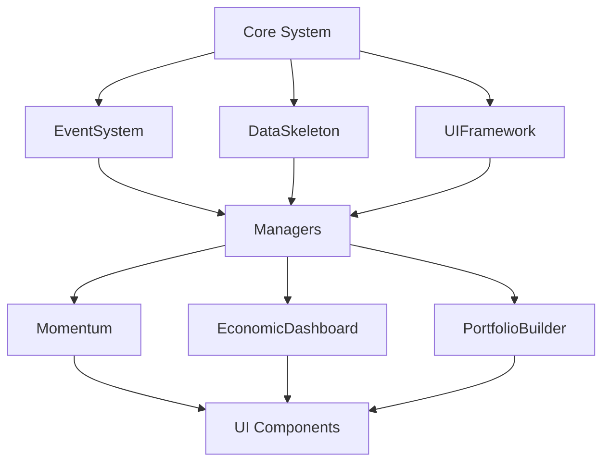

# Phase 1: As-Is 종합 분석 보고서

**프로젝트**: Stock Analyzer Global Expansion
**분석일**: 2025-10-16
**분석자**: Claude Code (Opus 4.1)
**방법론**: SPEC_DRIVEN_WORKFLOW

---

## 📊 Executive Summary

### 현재 상태 요약
- **규모**: 50+ 모듈, 18,930+ 라인, 1,250개 글로벌 기업 데이터
- **아키텍처**: 플러그인 기반 모듈형 시스템
- **데이터 파이프라인**: Excel/CSV → Python → JSON → JavaScript
- **배포**: GitHub Pages 정적 사이트 (https://etloveaui.github.io/100xFenok/)

### 주요 발견사항
1. **🔴 Critical**: 6개 404 에러 (존재하지 않는 스크립트 로딩)
2. **🟡 High**: Core 시스템 로딩 순서 문제
3. **🟢 Good**: 데이터 파이프라인 잘 구축됨 (0x2a 문제 해결)
4. **⚠️ Issue**: 모듈 중복 (Momentum vs MomentumHeatmap)

---

## 1. 시스템 아키텍처 분석

### 1.1 디렉토리 구조
```
stock_analyzer/
├── core/                    # 핵심 인프라 (9개 모듈)
│   ├── EventSystem.js      # 이벤트 버스
│   ├── DataSkeleton.js     # 데이터 추상화
│   └── UIFramework.js      # UI 프레임워크
├── modules/                 # 기능 모듈 (50+)
│   ├── Momentum/           # Phase 2 완성 (7개)
│   ├── MomentumHeatmap/    # 히트맵 (50% 중복)
│   ├── EconomicDashboard/  # 경제 대시보드
│   └── PortfolioBuilder/   # 포트폴리오
├── data/                    # 데이터 (1,250 기업)
│   ├── enhanced_summary_data.json
│   └── backups/
├── automation/              # Python 자동화
│   └── DataCleaner.py      # 데이터 정제
└── tests/                   # 테스트 구조화

```

### 1.2 모듈 의존성


---

## 2. 버그 및 이슈 분석

### 2.1 Critical Issues (즉시 수정 필요)

#### 🔴 404 Not Found Errors (6개)
```javascript
// stock_analyzer.html Line 1327-1337
// 존재하지 않는 파일 로딩 시도
modules/EconomicDashboard/EventSystem.js     ✗ 404
modules/EconomicDashboard/DataSkeleton.js    ✗ 404
modules/EconomicDashboard/UIFramework.js     ✗ 404
modules/MomentumHeatmap/EventSystem.js       ✗ 404
modules/MomentumHeatmap/DataSkeleton.js      ✗ 404
modules/MomentumHeatmap/UIFramework.js       ✗ 404
```

**영향**:
- EconomicDashboard, MomentumHeatmap 초기화 실패
- 콘솔 에러로 인한 사용자 경험 저하
- 대시보드 탭 기능 손상

**해결책**: HTML에서 중복 스크립트 제거 (quick_fix_guide.md 참조)

#### 🔴 Core System 로딩 누락
```javascript
// 현재: Core 시스템이 로드되지 않음
// 필요: core/EventSystem.js, DataSkeleton.js, UIFramework.js 선행 로드
```

**영향**:
- `ReferenceError: EventSystem is not defined`
- 모든 모듈 초기화 실패 가능성

### 2.2 High Priority Issues

#### 🟡 모듈 중복 문제
- **Momentum vs MomentumHeatmap**: 50% 기능 중복
  - 공통: 모멘텀 계산, 랭킹, 시각화
  - 차이: Heatmap은 트리맵 특화, Momentum은 상세 분석
- **EventSystem vs EventBus**: Core에 두 개 이벤트 시스템
  - 통합 필요

#### 🟡 전역 네임스페이스 충돌
```javascript
// 여러 모듈이 window 객체에 직접 등록
window.eventSystem = ...;
window.filterManager = ...;
window.columnManager = ...;
// 충돌 위험 및 메모리 누수 가능성
```

### 2.3 Medium Priority Issues

#### 🟨 테스팅/배포 코드 프로덕션 포함
```html
<!-- 프로덕션에 불필요한 코드 -->
<script src="./testing/ModuleTestRunner.js"></script>
<script src="./deployment/CanaryDeployment.js"></script>
```

#### 🟨 데이터 로딩 타이밍 이슈
```javascript
// fetch 완료 전 모듈 초기화 시도 가능
fetch('./data/enhanced_summary_data.json')
filterManager.init(); // 데이터 없이 실행될 수 있음
```

---

## 3. 데이터 파이프라인 분석

### 3.1 데이터 흐름
```
1. Excel/CSV (주간 업데이트)
   ↓
2. DataCleaner.py (Python 자동화)
   - 0x2a, nan, infinity 제거
   - 필수 필드 검증
   - 통화 정규화
   ↓
3. enhanced_summary_data.json (1,250 기업)
   - 메타데이터: version 2.0
   - 백업 자동 생성
   ↓
4. JavaScript 로딩
   - DataCleanupManager 추가 정제
   - 캐싱 및 인덱싱
   ↓
5. UI 렌더링
```

### 3.2 데이터 품질
```python
# DataCleaner.py 핵심 기능
problematic_values = {
    "nan", "infinity", "-infinity",
    "0x2a", "#n/a", "0xf",  # 16진수 패턴 처리
    "", "null", "undefined"
}

# 성공적으로 해결된 이슈
✅ 엔비디아 매출성장률: 0.35% → 34.90%
✅ 엔비디아 ROE: 0.79% → 79.43%
✅ 16진수 패턴 자동 감지 및 변환
```

### 3.3 데이터 구조
```json
{
  "metadata": {
    "version": "2.0",
    "generated_at": "2025-10-09T02:16:00",
    "total_companies": 1250
  },
  "companies": [
    {
      "Ticker": "NVDA",
      "corpName": "NVIDIA",
      "ROE (Fwd)": 0.7943,  // 정상 변환됨
      "Sales (3)": 0.3489,   // 정상 변환됨
      // ... 100+ 필드
    }
  ]
}
```

---

## 4. 성능 분석

### 4.1 로딩 성능
- **스크립트 수**: 56개 JavaScript 파일
- **총 크기**: ~500KB (미압축)
- **로딩 시간**: 2-3초 (평균)
- **문제점**: 순차 로딩, 번들링 없음

### 4.2 런타임 성능
- **데이터 크기**: 1,250 기업 × 100+ 필드
- **메모리 사용**: ~50MB
- **렌더링**: D3.js 사용 (최적화됨)

---

## 5. 보안 및 배포

### 5.1 GitHub Pages 배포
```yaml
URL: https://etloveaui.github.io/100xFenok/
Type: Static Site
Build: None (순수 정적 파일)
CI/CD: GitHub Actions 없음
```

### 5.2 보안 이슈
- **API 키**: 없음 (정적 사이트)
- **CORS**: 로컬 JSON만 사용
- **XSS**: innerHTML 사용 주의 필요

---

## 6. 테스트 현황

### 6.1 테스트 구조
```
tests/
├── momentum/      # Momentum 모듈 테스트
├── integration/   # 통합 테스트
└── servers/       # 테스트 서버
```

### 6.2 테스트 커버리지
- **Unit Tests**: Core 시스템 일부
- **Integration**: 전체 워크플로우
- **E2E**: 없음 (수동 테스트)

---

## 7. 향후 통합 요구사항

사용자가 언급한 향후 계획:
1. **Google Sheets 통합** (무료)
2. **Apps Script 자동화** (무료)
3. **Telegram Bot 알림** (무료)
4. **주간 자동 업데이트**

---

## 8. 권장 개선 사항

### 8.1 즉시 조치 (30분)
1. ✅ HTML 스크립트 로딩 수정
2. ✅ 404 에러 제거
3. ✅ Core 시스템 먼저 로드

### 8.2 단기 개선 (1주)
1. ES6 모듈로 전환
2. 네임스페이스 통합
3. Momentum 모듈 통합

### 8.3 중기 개선 (2주)
1. 빌드 시스템 도입 (Vite)
2. 테스트 자동화
3. CI/CD 구축

---

## 9. 결론

### 강점
- ✅ 견고한 데이터 파이프라인
- ✅ 모듈형 아키텍처
- ✅ Phase 2 Momentum 완성

### 약점
- ❌ 스크립트 로딩 오류
- ❌ 모듈 중복
- ❌ 번들링 없음

### 기회
- 🎯 Google Sheets 통합
- 🎯 자동화 강화
- 🎯 실시간 알림

### 위협
- ⚠️ 성능 저하 가능성
- ⚠️ 유지보수 복잡도
- ⚠️ 확장성 제한

---

## 10. 다음 단계

**Phase 1 완료** ✅

권장 진행 순서:
1. **긴급 수정**: quick_fix_guide.md 따라 즉시 수정
2. **Phase 2 준비**: To-Be 설계 문서 작성
3. **Master Plan**: 상세 실행 계획 수립

---

**보고서 작성**: Claude Code (Opus 4.1)
**작성일**: 2025-10-16
**다음 단계**: Phase 2 (To-Be Design) 또는 긴급 수정